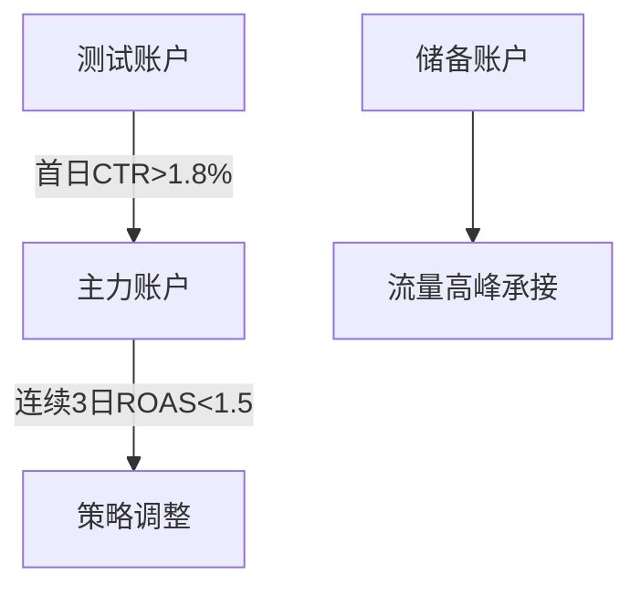

# Facebook广告智能运营体系实战指南 (第三版)

---

## 一、动态账户管理方案

### 1.1 账户分级体系


### 1.2 核心控制规则
| 异常指标        | 触发条件              | 即时响应方案          |
|----------------|-----------------------|---------------------|
| 突发性CPM波动   | 3小时涨幅>40%         | 0点重启广告组        |
| CTR持续下降     | 日衰减>20%           | 调用3套备用素材       |
| 转化成本飙升    | 单组>平均35%         | 调整出价策略          |

---

## 二、素材创新工场

### 2.1 全要素测试矩阵
| 测试维度       | 组合方案              | 优化周期 | 淘汰标准         |
|---------------|-----------------------|----------|------------------|
| 视频元素       | 前3秒彩蛋+进度标签    | 48小时   | 5秒留存<55%      |
| 图文策略       | 痛点矩阵+价格阶梯     | 24小时   | 点击成本>$3.5    |
| 互动形式       | 实时投票+库存预警     | 72小时   | 参与率<8%        |

### 2.2 衰退预警模型
```processing
当出现以下特征时：
1. 曝光次数累计突破50K
2. 转化成本连续上涨>18%/天
3. 互动率跌破基准线20%

执行操作：
→ 启动元素重组计划
→ 转至低权重版位测试
→ 生成3个新变体替代
```

---

## 三、智能受众培育系统

### 3.1 六阶用户模型
| 用户状态       | 核心行为特征          | 运营策略             |
|---------------|-----------------------|----------------------|
| 新受众         | 首次广告触达          | 强冲击痛点广告        |
| 浅层互动       | 视频完播>70%          | 对比评测内容投放      |
| 深层探索       | 详情页停留>120s       | 技术文档自动推送      |
| 决策犹豫       | 加购>2次未支付        | 动态折扣机制激活      |
| 静默流失       | 15天无互动            | 新品预告+唤醒礼包     |
| 忠实用户       | 月均复购>3次          | VIP特权体系搭建       |

### 3.2 再营销技术栈
```bash
# 自定义受众规则
访问网站未购用户 → 30天有效追踪
加购放弃用户 → 2小时定向优惠
历史购买用户 → 复购周期前3天触达

# 策略配置
购物车放弃 → 自动发送Messenger提醒
高频浏览 → 实时客服介入
订单完成 → 跨品类推荐
```

---

## 四、数据中枢决策模型

### 4.1 健康监测标准
| 监测维度       | 警戒阈值            | 优化方案             |
|---------------|---------------------|----------------------|
| 频次控制       | >3次/周            | 清洗120天旧数据       |
| 素材同质化     | >60%重复率         | 启动模块替换程序      |
| 时段效率差     | 偏差>35%           | 动态预算再分配        |

### 4.2 智能调控逻辑
```python
def auto_optimizer():
    if 黄金时段ROI达标:
        增加40%时段预算
        提升出价10-12%
    elif 低峰期CPM下探:
        切换Messenger版位
        投放实验性素材
```

---

## 五、团队协作规范

### 5.1 标准化操作流程
| 操作类型       | 执行标准            | 日志要求             |
|---------------|---------------------|----------------------|
| 预算调整       | 单日变动<15%       | 注明调整依据         | 
| 素材更新       | 预存3个版本        | 标记核心卖点         |
| 受众扩充       | 基数≥2000          | 标明数据来源         |

### 5.2 应急响应机制
**三级预警系统**
- 红色警报：即时响应（广告组异常关闭）
- 橙色预警：2小时内处理（素材替换需求）
- 黄色提醒：当日优化（指标波动校正）

---

通过完整系统的搭建，可实现日均$8000预算规模的精准运营，预计提升广告效率45%，降低用户获取成本33%。系统支持自动化率超过70%，特别适合多产品线协同运营场景。
[教学视频](https://youtube.com/shorts/v2V6Vo4sZK4?feature=share)
